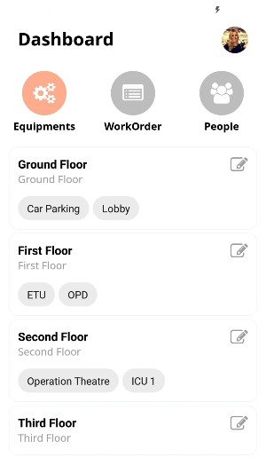

# fixapp-mobile

## Table of contents

* [General info](#general-info)
* [Technologies](#technologies)
* [To-do](#to-do)

## General info

Fixapp is an platform which is under development to support field service engineers and technicians to track corrective maintenance/ breakdown requests easily without having to use a single paper. This total system is consist of,
* a mobile app for engineers and technicians
* a chat bot for requesters to raise complaints on faulty/broken equipment
this repository is for the mobile app 

## Screenshots

## Technologies

* [expo](https://docs.expo.io/)
* [react-native](https://facebook.github.io/react-native/)
* [firebase](http://firebase.google.com/)

## To-do
* connect to firestore 
* complete the Dashboard screen 